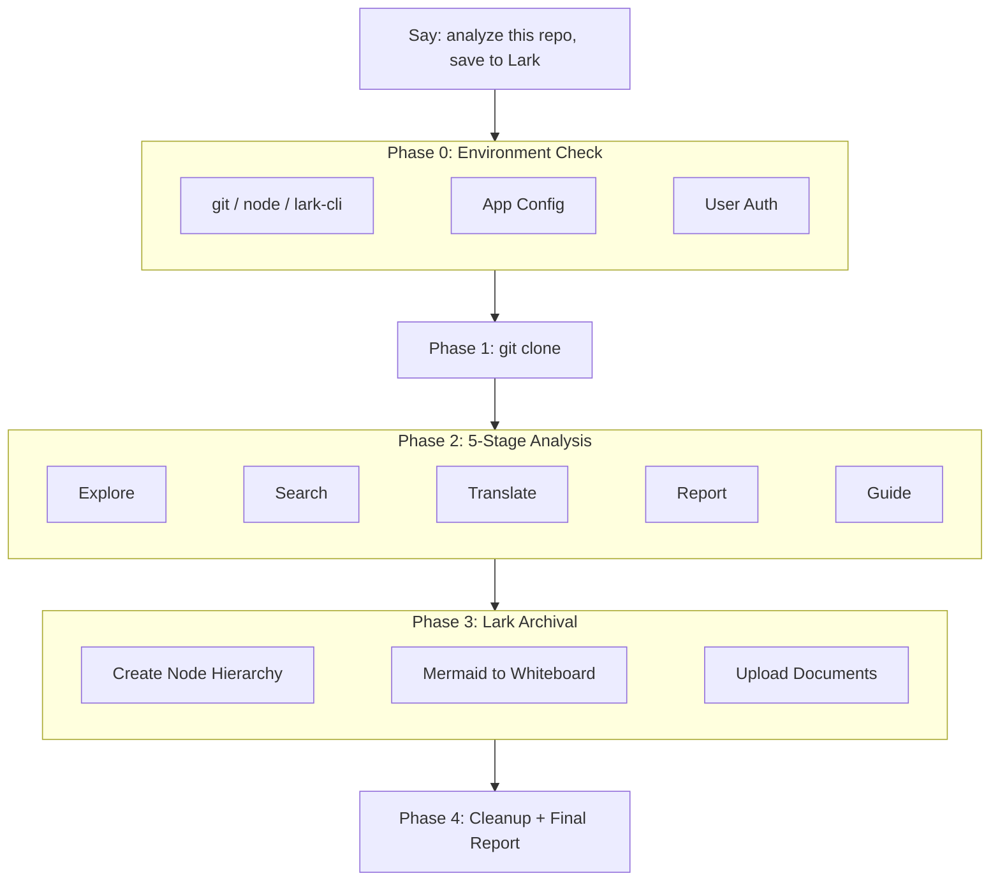

<div align="center">
  <h1>lark-project-archive</h1>
  <p>
    <strong>GitHub Project Analysis + Lark/Feishu Wiki Archival</strong><br>
    One command to: clone a GitHub repo, systematically analyze prompts & architecture, generate reports, and archive everything to Lark/Feishu wiki (with Mermaid diagrams auto-converted to Lark whiteboards).
  </p>
</div>

<p align="center">
  <a href="./README.en.md"></a>
  <a href="./README.md"></a>
</p>

<p align="center">
  <a href="./LICENSE"></a>
  
  
  
  
</p>

<p align="center">
  <a href="https://github.com/larksuite/cli">lark-cli</a> |
  <a href="https://github.com/autumnseasonism/learn-ai-projects-skills">learn-ai-projects</a> |
  <a href="https://github.com/autumnseasonism/lark-project-archive/issues">Issues</a>
</p>

---

<details open>
<summary><b>Table of Contents</b></summary>

- [What Problem Does It Solve](#what-problem-does-it-solve)
- [Before / After](#before--after)
- [Quick Start](#quick-start)
- [Architecture](#architecture)
- [Lark Wiki Structure](#lark-wiki-structure)
- [Mermaid to Lark Whiteboard](#mermaid-to-lark-whiteboard)
- [Installation](#installation)
- [Compatible Agents](#compatible-agents)
- [Features](#features)
- [File Structure](#file-structure)
- [Dependencies](#dependencies)
- [Acknowledgements](#acknowledgements)
- [Contributing](#contributing)

</details>

## What Problem Does It Solve

You want to analyze an open-source AI project's prompts and architecture, then organize the results into your Lark/Feishu wiki — adjusting formatting, redrawing diagrams, building node hierarchies one by one. The analysis alone takes hours, and archival takes another half day.

**lark-project-archive** does it all in one command: auto-clone, 5-stage deep analysis, reports and guides written directly into Lark wiki, Mermaid architecture diagrams auto-converted to Lark whiteboards. From GitHub to Lark, fully automated.

## Before / After

| | Manual Analysis + Manual Archival | lark-project-archive |
|---|:---:|:---:|
| **Analyze project** | Manually search code for prompts, easy to miss | 8 search methods, full coverage, auto-translate |
| **Write report** | Manually organize architecture diagrams and docs | Auto-generate 8-chapter technical report + 12-chapter guide |
| **Save to Lark** | Manually create nodes, copy-paste, fix formatting | One-click wiki node hierarchy + content upload |
| **Draw diagrams** | Redraw everything in Lark | Mermaid auto-converted to Lark whiteboards |
| **Team sharing** | Check formatting before sharing link | Archive = share, clear structure, ready to browse |

## Quick Start

```
Analyze this AI project and archive to Lark wiki: https://github.com/autumnseasonism/lark-project-archive
```

The skill automatically completes four phases:

1. **Clone** — `git clone --depth 1` shallow clone to local
2. **Analyze** — 5-stage systematic analysis (explore → prompt search → translate & document → technical report → product guide)
3. **Archive** — Auto-create Lark wiki node hierarchy, convert Mermaid diagrams to whiteboards, upload all documents
4. **Cleanup** — Preserve analysis results locally as `<repo>-ai_analysis/`, delete cloned code

**More trigger examples:**

```
Analyze this AI project and archive to Lark wiki
Study this lark-project-archive and save to Feishu knowledge base
Clone this project, analyze it, then store in Lark
帮我拆解这个 AI 项目并归档到飞书
分析这个 repo 存到知识库
```

> [!NOTE]
> Trigger requires both conditions: (1) a GitHub project URL, and (2) intent to archive to Lark/Feishu wiki. Analysis-only requests won't trigger (use [learn-ai-projects](https://github.com/autumnseasonism/learn-ai-projects-skills) instead). Lark-only operations won't trigger either.

## Architecture



## Lark Wiki Structure

```
[Wiki Space]
└── student                          ← Unified container node (auto-find or create)
    └── [Project Type]-[Project Name] ← Project root node (overview + navigation)
        ├── Technical Analysis Report  ← 8-chapter deep technical analysis (with whiteboard diagrams)
        │   ├── Prompt Translation 1   ← Bilingual (EN/CN) translation
        │   ├── Prompt Translation 2
        │   └── ...
        └── Product Guide              ← 12-chapter user-friendly guide
```

## Mermaid to Lark Whiteboard

Mermaid diagrams in analysis reports (architecture diagrams, sequence diagrams, flow charts) are automatically converted to Lark whiteboards embedded in documents:

```
Mermaid code block → Replace with whiteboard placeholder → Upload markdown → Get board_tokens → whiteboard-cli render → Upload whiteboard content
```

Supports flowcharts, sequence diagrams, class diagrams, mind maps, pie charts, state diagrams, Gantt charts, ER diagrams, and Git graphs. Falls back to code block text on render failure.

## Installation

### Prerequisites

- An Agent app supporting the SKILL.md spec (see [Compatible Agents](#compatible-agents))
- [lark-cli](https://github.com/larksuite/cli) >= 1.0.9
- [Node.js](https://nodejs.org/) >= 18 (for Mermaid whiteboard rendering)
- A Lark/Feishu developer app (guided setup on first run)

### Install

**Recommended: just tell your Agent**

```text
Please install this skill:
https://github.com/autumnseasonism/lark-project-archive
```

If the agent supports skill installation, this is usually the simplest option.

**If you want to install it manually**

```bash
# Put it in the current project directory, or in your agent's skill scan path
git clone https://github.com/autumnseasonism/lark-project-archive.git
```

Place the repository directory in the current project directory, or in that agent's skill scan path.

> [!TIP]
> Different agents use different global skill directories. If you are unsure, ask the agent to install it for you first.

### First Run

The skill automatically guides you through initialization — no manual configuration needed:

1. **App Config** — Bind a Lark developer app (`lark-cli config init --new`)
2. **User Auth** — One-time authorization for all required permissions (9 scopes)
3. **Command Permission** — If your agent asks before running commands, allow `lark-cli` / `npx` / `git`

After these three steps, just talk to trigger the skill.

## Compatible Agents

This skill is built on the open [SKILL.md](https://docs.anthropic.com/en/docs/claude-code/skills) spec and is not tied to any specific agent platform. Below are tested or compatible agents:

| Agent | Install Path | Notes |
|-------|-------------|-------|
| [Claude Code](https://claude.com/claude-code) | `~/.claude/skills/` or project directory | Supports auto command allowlist |
| [Codex CLI](https://github.com/openai/codex) | Agent skills scan path | — |
| [Trae](https://www.trae.cn/) | Agent skills scan path | — |
| [Cline](https://cline.bot/) | Agent skills scan path | — |
| [Cursor](https://cursor.sh/) | Agent skills scan path | — |

> [!NOTE]
> Agents not listed above can still use this skill as long as they support the SKILL.md spec. PRs to add test results are welcome.

## Features

- **Zero Code, Pure Skill** — Implemented entirely via `SKILL.md` + references + templates, no external scripts
- **Self-Contained** — Analysis workflow, Lark operations, and auth management all built-in
- **Progressive Loading** — SKILL.md handles orchestration (~450 lines), detailed specs loaded on-demand from references/, saving context
- **Mermaid to Whiteboard** — Architecture diagrams in reports auto-convert to native Lark whiteboards
- **8 Search Methods** — Covers filenames, code variables, API calls, config files, and more
- **Large Project Support** — 4-tier scaling strategy by size (<=30 / 31-100 / 101-300 / 300+), parallel sub-agents
- **Resume from Checkpoint** — Detects existing outputs after interruption, continues from where it left off
- **Graceful Degradation** — Partial failures don't block the overall workflow, honestly reports incomplete items
- **Trigger Test Coverage** — 53 test cases (25 positive / 17 negative / 11 edge), 98.1% trigger accuracy

## File Structure

```
lark-project-archive/
├── SKILL.md                            # Main skill file (4-phase workflow orchestration)
├── references/
│   ├── lark-cli-setup.md               # lark-cli config, auth, permissions
│   ├── wiki-archive.md                 # Wiki space and node operations
│   ├── doc-whiteboard.md               # Document writing and whiteboard integration
│   ├── mermaid-rendering.md            # Mermaid → Lark whiteboard full pipeline
│   ├── analysis-workflow.md            # 5-stage analysis detailed workflow
│   ├── scale-strategies.md             # Size-based scaling strategies
│   ├── verification.md                 # MANIFEST format and verification flow
│   └── fault-handling.md               # Fault classification and graceful degradation
├── templates/
│   ├── search_patterns.md              # 8 search methods and regex patterns
│   ├── doc_template.md                 # Translation document template
│   ├── report_template.md              # Analysis report template (8 chapters)
│   └── guide_template.md              # Product guide template (12 chapters)
├── evals/
│   └── evals.json                      # 53 trigger test cases
├── LICENSE
├── README.md
└── README.en.md
```

## Dependencies

| Dependency | Purpose | Required? | License |
|-----------|---------|-----------|---------|
| [lark-cli](https://github.com/larksuite/cli) | Lark/Feishu API CLI tool | **Required** | MIT |
| [@larksuite/whiteboard-cli](https://www.npmjs.com/package/@larksuite/whiteboard-cli) | Mermaid → Lark whiteboard rendering | Optional (auto-installed via npx) | MIT |

> [!TIP]
> `@larksuite/whiteboard-cli` converts Mermaid diagrams to native Lark whiteboards. Without it, diagrams gracefully degrade to text code blocks — all other features work normally. Requires Node.js 18+; npx auto-downloads on first use.

This project does not include any code from the above dependencies — it only invokes their functionality via the command line.

## Acknowledgements

The analysis workflow is based on [learn-ai-projects](https://github.com/autumnseasonism/learn-ai-projects-skills) (MIT License), whose core ideas and inspiration come from [@comeonzhj](https://github.com/comeonzhj)'s [howPrompt](https://github.com/comeonzhj/howPrompt). Thanks to the original authors for their open-source contributions!

## Contributing

Issues and Pull Requests are welcome.

## License

[MIT](LICENSE)
