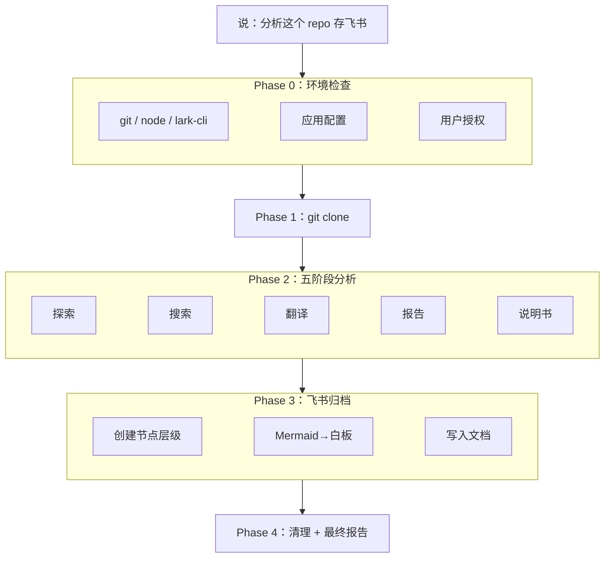

<div align="center">
  <h1>lark-project-archive</h1>
  <p>
    <strong>GitHub 项目分析 + 飞书知识库一键归档</strong><br>
    一句话触发：自动克隆 GitHub 项目、系统化分析提取提示词与架构、生成技术报告和产品说明书、归档到飞书知识库（Mermaid 图表自动转飞书白板）。
  </p>
</div>

<p align="center">
  <a href="./README.en.md"></a>
  <a href="./README.md"></a>
</p>

<p align="center">
  <a href="./LICENSE"></a>
  
  
  
  
</p>

<p align="center">
  <a href="https://github.com/larksuite/cli">lark-cli</a> |
  <a href="https://github.com/autumnseasonism/learn-ai-projects-skills">learn-ai-projects</a> |
  <a href="https://github.com/autumnseasonism/lark-project-archive/issues">Issues</a>
</p>

---

<details open>
<summary><b>目录</b></summary>

- [它解决什么问题](#它解决什么问题)
- [Before / After](#before--after)
- [一句话怎么用](#一句话怎么用)
- [架构](#架构)
- [飞书知识库结构](#飞书知识库结构)
- [Mermaid → 飞书白板](#mermaid--飞书白板)
- [安装](#安装)
- [兼容 Agent](#兼容-agent)
- [技术特点](#技术特点)
- [文件结构](#文件结构)
- [依赖](#依赖)
- [致谢](#致谢)
- [贡献](#贡献)

</details>

## 它解决什么问题

想分析一个开源 AI 项目的提示词和架构，分析完还得手动复制到飞书知识库里整理成文档——格式要调、图表要重画、节点层级要一个个建。光分析就要好几个小时，归档又要大半天。

**lark-project-archive** 一句话下去，自动克隆 → 五阶段深度分析 → 报告和说明书直接写入飞书知识库，Mermaid 架构图自动变成飞书白板。从 GitHub 到飞书，全程自动。

## Before / After

| | 手动分析 + 手动归档 | lark-project-archive |
|---|:---:|:---:|
| **分析项目** | 自己翻代码找提示词，容易遗漏 | 8 种方法全量扫描，自动翻译 |
| **写报告** | 手动整理架构图和分析文档 | 自动生成 8 章技术报告 + 12 章说明书 |
| **存飞书** | 手动建节点、复制粘贴、调格式 | 一键创建知识库节点层级 + 写入内容 |
| **画架构图** | 飞书里重新画一遍 | Mermaid 自动转飞书白板嵌入文档 |
| **团队分享** | 发链接前还要检查格式 | 归档即分享，结构清晰可直接查阅 |

## 一句话怎么用

```
帮我拆解这个 AI 项目并归档到飞书 https://github.com/autumnseasonism/lark-project-archive
```

技能自动完成四个阶段：

1. **克隆** — `git clone --depth 1` 浅克隆到本地
2. **分析** — 五阶段系统化分析（探索 → 提示词搜索 → 翻译文档化 → 技术报告 → 产品说明书）
3. **归档** — 自动创建飞书知识库节点层级，Mermaid 图表转白板，写入所有文档
4. **清理** — 保留分析结果到本地 `<repo>-ai_analysis/`，删除克隆代码

**更多触发方式：**

```
帮我拆解这个 AI 项目并归档到飞书
分析这个 lark-project-archive 存到知识库
学习这个开源项目并保存报告到飞书 wiki
clone 这个项目分析下然后存飞书
analyze this repo and archive to lark wiki
study this project and save to feishu
```

> [!NOTE]
> 触发需要同时满足两个条件：(1) GitHub 项目地址 (2) 飞书/知识库归档意图。仅有分析需求不触发（用 [learn-ai-projects](https://github.com/autumnseasonism/learn-ai-projects-skills)），仅有飞书操作不触发。

## 架构



## 飞书知识库结构

```
[知识空间]
└── student                          ← 统一容器节点（自动查找或新建）
    └── [项目类型]-[项目名]           ← 项目根节点（含项目概述 + 导航）
        ├── 技术分析报告               ← 8 章深度技术分析（含白板架构图）
        │   ├── 提示词翻译文档 1       ← 中英对照翻译
        │   ├── 提示词翻译文档 2
        │   └── ...
        └── 产品说明书                 ← 12 章面向非技术人员的使用指南
```

## Mermaid → 飞书白板

分析报告中的 Mermaid 图表（架构图、时序图、链路图）自动转换为飞书白板嵌入文档：

```
Mermaid 代码块 → 替换为白板占位符 → 上传 markdown → 获取 board_tokens → whiteboard-cli 渲染 → 上传白板内容
```

支持流程图、时序图、类图、思维导图、饼图、状态图、甘特图、ER 图、Git 图。渲染失败时降级为代码块文本展示。

## 安装

### 前置条件

- 支持 SKILL.md 规范的 Agent 应用（见[兼容 Agent](#兼容-agent)）
- [lark-cli](https://github.com/larksuite/cli) >= 1.0.9
- [Node.js](https://nodejs.org/) >= 18（用于 Mermaid 白板渲染）
- 一个飞书自建应用（首次使用时自动引导配置）

### 安装方式

**推荐方式：直接对 Agent 说**

```text
请帮我安装这个 skill：
https://github.com/autumnseasonism/lark-project-archive
```

如果该 Agent 支持安装 skill，通常这就是最简单的方式。

**如果你想手动安装**

```bash
# 放在当前项目目录，或放到 Agent 的 skills 扫描路径下
git clone https://github.com/autumnseasonism/lark-project-archive.git
```

将仓库目录放到当前项目目录，或对应 Agent 的 skills 扫描路径下。

> [!TIP]
> 不同 Agent 的全局 skills 目录并不相同；如果不确定，优先直接让 Agent 帮你安装。

### 首次使用

技能会自动引导你完成初始化，无需手动配置：

1. **应用配置** — 绑定飞书自建应用（`lark-cli config init --new`）
2. **用户授权** — 一次性授权所有需要的权限（9 个 scope）
3. **命令授权** — 如果 Agent 会拦截命令执行，允许 `lark-cli` / `npx` / `git`

三步完成后，后续使用直接说话即可。

## 兼容 Agent

本技能基于 [SKILL.md](https://docs.anthropic.com/en/docs/claude-code/skills) 开放规范，不绑定特定 Agent 平台。以下是已测试或兼容的 Agent：

| Agent | 安装路径 | 备注 |
|-------|---------|------|
| [Claude Code](https://claude.com/claude-code) | `~/.claude/skills/` 或项目目录 | 支持命令白名单自动配置 |
| [Codex CLI](https://github.com/openai/codex) | Agent skills 扫描路径 | — |
| [Trae](https://www.trae.cn/) | Agent skills 扫描路径 | — |
| [Cline](https://cline.bot/) | Agent skills 扫描路径 | — |
| [Cursor](https://cursor.sh/) | Agent skills 扫描路径 | — |

> [!NOTE]
> 表中未列出的 Agent 只要支持 SKILL.md 规范即可使用。欢迎提交 PR 补充测试结果。

## 技术特点

- **零代码，纯 Skill** — 完全通过 `SKILL.md` + references + templates 实现，无外部脚本依赖
- **自包含设计** — 分析流程、飞书操作、认证权限全部内嵌，不依赖其他技能包
- **渐进式加载** — SKILL.md 做调度（~450 行），详细规范按需从 references/ 加载，节省上下文
- **Mermaid → 白板** — 分析报告中的架构图自动转为飞书原生白板，无需手动重画
- **8 种搜索方法** — 覆盖文件名、代码变量、API 调用、配置文件等所有维度
- **大型项目支持** — 按规模分 4 级策略（≤30 / 31-100 / 101-300 / 300+），子代理并行
- **断点续传** — 分析中断后检测已有产出，从断点继续而非重头开始
- **故障降级** — 部分失败不阻塞整体流程，如实报告未完成项
- **触发测试覆盖** — 53 个测试用例（25 正向 / 17 负向 / 11 边缘），触发准确率 98.1%

## 文件结构

```
lark-project-archive/
├── SKILL.md                            # 主技能文件（四阶段工作流编排）
├── references/
│   ├── lark-cli-setup.md               # lark-cli 配置、认证、权限管理
│   ├── wiki-archive.md                 # 知识库空间和节点操作
│   ├── doc-whiteboard.md               # 文档写入和白板集成
│   ├── mermaid-rendering.md            # Mermaid → 飞书白板完整流程
│   ├── analysis-workflow.md            # 五阶段分析详细流程
│   ├── scale-strategies.md             # 按规模分级的执行策略
│   ├── verification.md                 # MANIFEST 格式与验证流程
│   └── fault-handling.md               # 故障分类与降级交付
├── templates/
│   ├── search_patterns.md              # 8 种搜索方法与正则模式
│   ├── doc_template.md                 # 翻译文档模板
│   ├── report_template.md              # 分析报告模板（8 章）
│   └── guide_template.md              # 产品说明书模板（12 章）
├── evals/
│   └── evals.json                      # 53 个触发测试用例
├── LICENSE
├── README.md
└── README.en.md
```

## 依赖

| 依赖 | 用途 | 必需？ | 许可证 |
|------|------|--------|--------|
| [lark-cli](https://github.com/larksuite/cli) | 飞书 API 命令行工具 | **必需** | MIT |
| [@larksuite/whiteboard-cli](https://www.npmjs.com/package/@larksuite/whiteboard-cli) | Mermaid → 飞书白板渲染 | 可选（通过 npx 自动安装） | MIT |

> [!TIP]
> `@larksuite/whiteboard-cli` 用于将 Mermaid 图表转为飞书原生白板。不安装时自动降级为代码块文本展示，不影响其余功能。只需有 Node.js 18+，首次使用时 npx 会自动下载。

本项目不包含上述依赖的任何代码，仅通过命令行调用其功能。

## 致谢

本项目的分析流程基于 [learn-ai-projects](https://github.com/autumnseasonism/learn-ai-projects-skills)（MIT License），其核心思路和灵感来源于 [@comeonzhj](https://github.com/comeonzhj) 的 [howPrompt](https://github.com/comeonzhj/howPrompt)。感谢原作者的开源贡献！

## 贡献

欢迎提交 Issue 和 Pull Request。

## 许可证

[MIT](LICENSE)
