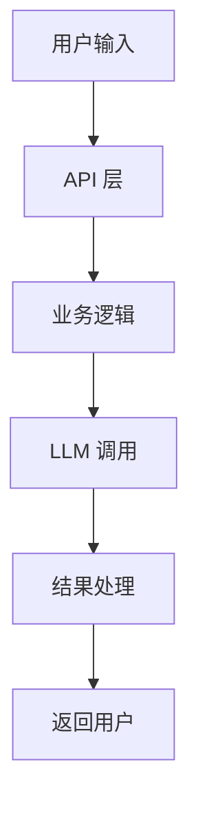
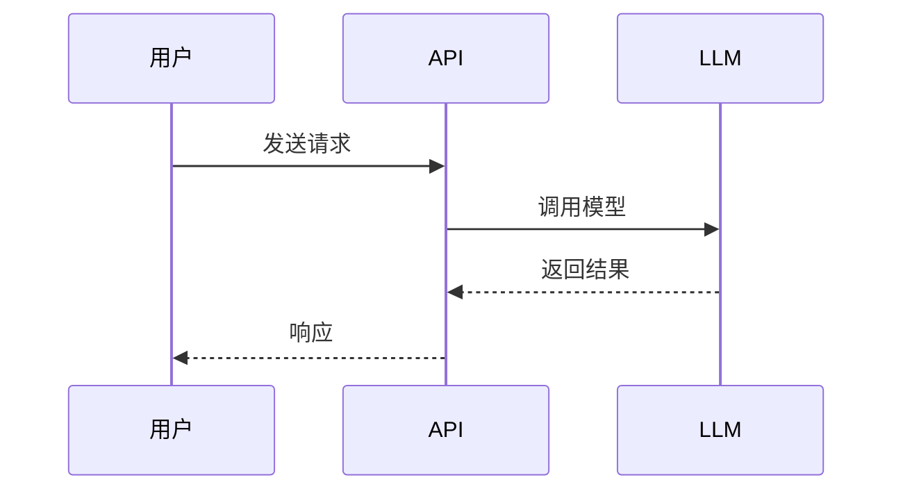
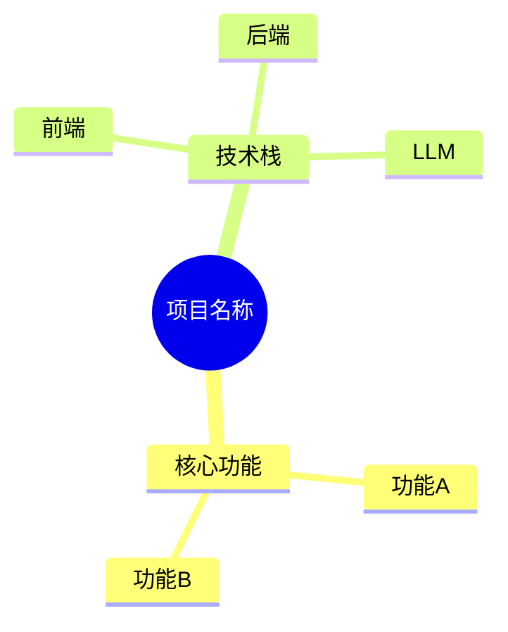

# Mermaid 图表 → 飞书白板

本文档包含从 markdown 中提取 Mermaid 图表、渲染为飞书白板并嵌入文档的完整流程。

## 前置依赖

- Node.js 18+
- `@larksuite/whiteboard-cli`（通过 npx 自动安装，无需手动安装）

### 跨平台临时文件

所有临时文件使用 `${TMPDIR:-/tmp}` 路径。Windows 上 `/tmp` 不存在，首次使用前须确保目录存在：
```bash
mkdir -p "${TMPDIR:-/tmp}"
```

## 完整处理流程

### Step 1: 提取 Mermaid 代码块

读取目标 markdown 文件，提取所有 Mermaid 代码块：

```javascript
// 使用 Node.js 提取（推荐，跨平台兼容）
const fs = require('fs');
const content = fs.readFileSync('report.md', 'utf8');
const matches = [...content.matchAll(/```mermaid\n([\s\S]*?)```/g)].map(m => m[1]);
// matches 是一个数组，每个元素是一个 Mermaid 代码块的内容
```

实际操作中使用 `node -e "..."` 执行。不要使用 `python3`（Windows 上可能不可用）。

### Step 1.5: Mermaid 语法清洗（渲染前必做）

Mermaid 解析器对非 ASCII 字符和中文标点敏感，渲染前必须清洗：

**1. 全角标点替换**：
```bash
# 使用 node 替换全角标点
node -e "
const fs = require('fs');
let code = fs.readFileSync(process.argv[1], 'utf8');
code = code.replace(/（/g,'(').replace(/）/g,')');
code = code.replace(/【/g,'[').replace(/】/g,']');
code = code.replace(/，/g,',').replace(/：/g,':');
code = code.replace(/；/g,';').replace(/｜/g,'|');
fs.writeFileSync(process.argv[1], code);
" diagram.mmd
```

**2. Subgraph 名称引号包裹**：
包含中文或特殊字符的 subgraph 必须使用 `subgraph id["显示名"]` 格式：
```
# 错误：会导致 Lexical error
subgraph 增量提取流程（主流程）

# 正确：使用 ID + 引号包裹的显示名
subgraph extract_flow["增量提取流程"]
```

**3. 节点标签引号**：
包含中文的节点标签建议使用双引号：`A["用户输入"]` 而非 `A[用户输入]`

**4. 快速验证**（可选）：
```bash
npx -y @mermaid-js/mermaid-cli mmdc -i diagram.mmd -o /dev/null 2>&1
# 返回 0 = 语法正确，非 0 = 有错误
```

### Step 2: 替换为白板占位符

将每个 `` ```mermaid ... ``` `` 代码块替换为 `<whiteboard type="blank"></whiteboard>`：

```bash
# 使用 sed 替换（注意多行匹配）
# 或在脚本中处理后写入临时文件
```

建议使用 Agent 子代理编写一个小脚本来完成提取和替换，保证准确性。

**记录映射关系**：保存一个有序列表，记录每个占位符位置对应的原始 Mermaid 代码。

### Step 3: 上传修改后的 markdown

```bash
lark-cli docs +update --doc <OBJ_TOKEN> --mode overwrite \
  --markdown "$(cat "${TMPDIR:-/tmp}/modified.md")" --as user
```

返回结果中的 `data.board_tokens` 数组包含所有新创建白板的 token，**顺序与占位符出现顺序对应**。

### Step 4: 逐个渲染并上传白板

对每个 (board_token, mermaid_code) 配对：

```bash
# 1. 保存 Mermaid 代码到临时文件
cat > "${TMPDIR:-/tmp}/diagram_N.mmd" << 'MERMAID_EOF'
graph TD
    A[用户输入] --> B[API 层]
    B --> C[业务逻辑]
MERMAID_EOF

# 2. 转换为 OpenAPI 格式并上传到白板
npx -y @larksuite/whiteboard-cli@^0.2.0 --to openapi \
  -i "${TMPDIR:-/tmp}/diagram_N.mmd" --format json | \
  lark-cli whiteboard +update \
    --whiteboard-token <BOARD_TOKEN_N> \
    --source - --yes --as user
```

### Step 5: 验证（可选）

导出白板预览图确认内容正确：

```bash
lark-cli whiteboard +query --whiteboard-token <BOARD_TOKEN> --output_as image --as user
```

## 支持的 Mermaid 图表类型

whiteboard-cli 支持以下 Mermaid 图表类型的渲染和上传：

| 图表类型 | Mermaid 语法关键字 | 适用场景 |
|---------|------------------|----------|
| 流程图 | `graph TD/LR` 或 `flowchart TD/LR` | 业务流程、数据流 |
| 时序图 | `sequenceDiagram` | API 调用链、交互流程 |
| 类图 | `classDiagram` | 对象关系、模块结构 |
| 思维导图 | `mindmap` | 知识分类、功能概览 |
| 饼图 | `pie` | 数据分布 |
| 状态图 | `stateDiagram-v2` | 状态机 |
| 甘特图 | `gantt` | 时间规划 |
| ER 图 | `erDiagram` | 数据库设计 |
| Git 图 | `gitGraph` | 分支流程 |

## Mermaid 语法约束

渲染质量受以下约束影响：

- **节点文本长度**：建议 ≤ 8 个字符，过长需缩写
- **流程图步骤数**：建议 ≤ 12 步，过多应拆分
- **标准符号**：
  - `A([开始])` — 圆角矩形（stadium）
  - `B{条件}` — 菱形
  - `C[步骤]` — 矩形
  - `D[(数据库)]` — 圆柱形
- **连线样式**：
  - `-->` 实线箭头
  - `-.->` 虚线箭头
  - `==>` 粗线箭头
  - `-->|标签|` 带标签箭头

## 常见 Mermaid 语法示例

### 架构图（分析报告第 2 章常用）



### 时序图



### 提示词链路图（分析报告第 4 章常用）


### 思维导图



## 错误处理

| 问题 | 原因 | 处理方式 |
|------|------|----------|
| Mermaid 渲染失败 | 语法错误 | 尝试修复语法；如无法修复，保留原始代码块作为文本 |
| Mermaid 中文标点解析错误 | 全角括号 `（）` 等 | 执行 Step 1.5 语法清洗后重试 |
| Subgraph 名称解析失败 | 未引号包裹的中文名称 | 改为 `subgraph id["中文名"]` 格式 |
| whiteboard-cli 未安装 | Node.js 缺失或版本过低 | npx 会自动下载，确保 Node.js 18+ |
| 白板上传失败 | 权限不足或 token 错误 | 检查 token 来源；确认 user 身份已授权 |
| 白板内容为空 | 仅创建了占位符未上传内容 | 检查 Step 4 是否执行 |

**降级策略**：如果 Mermaid 渲染或白板上传失败，将原始 Mermaid 代码块保留在文档中作为代码展示，并在 ERRORS.md 中记录失败原因。用户可以后续手动处理。

## 本地预览（可选）

如果需要在上传前预览渲染效果：

```bash
# 渲染为本地 PNG 图片
npx -y @larksuite/whiteboard-cli@^0.2.0 \
  -i "${TMPDIR:-/tmp}/diagram.mmd" \
  -o "${TMPDIR:-/tmp}/diagram.png"
```

生成的 PNG 可以展示给用户确认后再上传。

## 复杂图表处理

对于分析报告中的复杂架构图，如果 Mermaid 渲染效果不佳（文字截断、布局混乱），可以考虑使用 DSL 路径获得更精确的控制：

1. 将 Mermaid 代码转换为 whiteboard-cli DSL JSON 格式
2. 使用 flex/dagre 布局获得更好的排版
3. 应用颜色方案增强可读性

DSL JSON 基本结构：
```json
{
  "version": 2,
  "nodes": [
    {
      "type": "frame",
      "id": "root",
      "width": 1200,
      "height": "fit-content",
      "layout": "vertical",
      "gap": 20,
      "padding": 24,
      "fillColor": "#F0F4FC",
      "borderColor": "#5178C6",
      "borderWidth": 2,
      "children": [
        {
          "type": "text",
          "text": "标题",
          "fontSize": 18,
          "fontWeight": "bold"
        },
        {
          "type": "rect",
          "id": "node1",
          "width": 120,
          "height": 60,
          "text": "节点",
          "fillColor": "#FFFFFF",
          "borderColor": "#5178C6",
          "borderWidth": 2
        }
      ]
    },
    {
      "type": "connector",
      "connector": {
        "from": "node1",
        "to": "node2",
        "fromAnchor": "bottom",
        "toAnchor": "top",
        "lineColor": "#BBBFC4",
        "lineWidth": 2,
        "endArrow": "arrow"
      }
    }
  ]
}
```

**DSL 关键约束**：
- 文本节点 height 必须为 `'fit-content'`（固定值会截断）
- Connector 必须在顶层 nodes 数组中（不能嵌套在 frame.children 里）
- `layout: 'none'` 的容器必须有固定 width/height
- `'fill-container'` 只在 flex 父容器中有效

> 一般情况下 Mermaid 路径足够使用。仅在渲染效果确实不佳时才考虑 DSL 路径。
